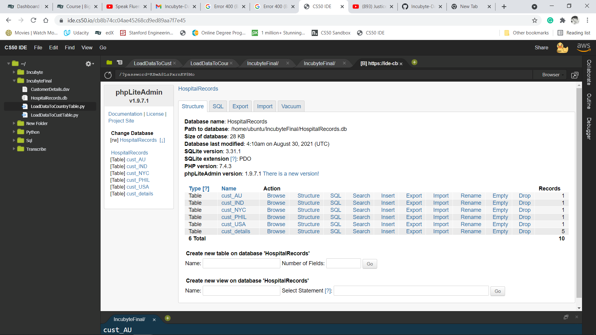

# Incubyte-DataEngineer

## Open Project in [CS50 IDE](https://ide.cs50.io/)

## Built With

- Python
- pandas
- sqlite3

# step 1:
Run /IncubyteFinal/LoadDataToCustTable.py for loading ".dsv" a file into the database
# step 2:
Run /IncubyteFinal/LoadDataToCustTable.py for loading data into corresponding country tables.

# Images:
**cs50 IDE Loading Data page**

**phpLiteAdmin page**

**phpLiteAdmin datatype page**

**phpLiteAdmin country india page**

